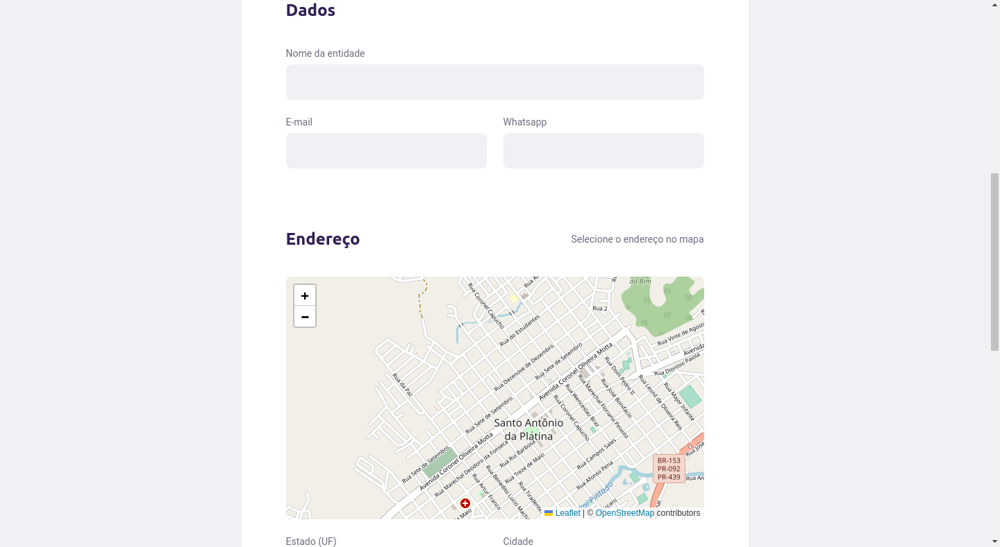
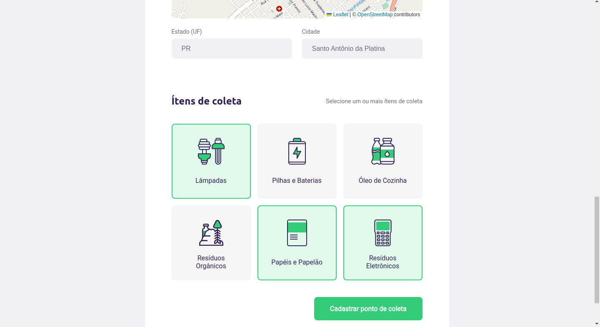
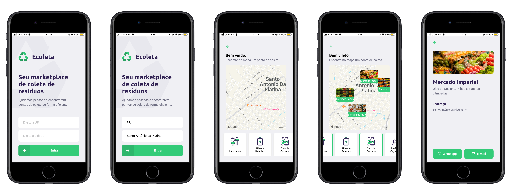

## Ecoleta

Aplicação desenvolvida com base na semana Next Level Week 1.0.

## Tecnologia :

Essas são as tecnologias usadas neste projeto

* NodeJs
* React
* React Native
* Sqlite
* Typescript

## Serviços usados :

* Github

## Apresentação:

### 1 - Ao acessar a aplicação pela web, será introduzido a página inicial.

### 2 - Ao clicar no botão "Cadastre um ponto de coleta" será redirecionado a secção de cadastro.

Após finalizar o cadastro clicando no botão será redirecionado ao inicio novamente.
### 3 - Consumindo a aplicação pelo app.

## Links
  - Repository: https://github.com/robovmp/nlw-1

  ## Versão

  1.0.0.0

  ## Autor

  * **Vinícius Martins Pedro** 

  Obrigado por me visitar e bora codar!!

